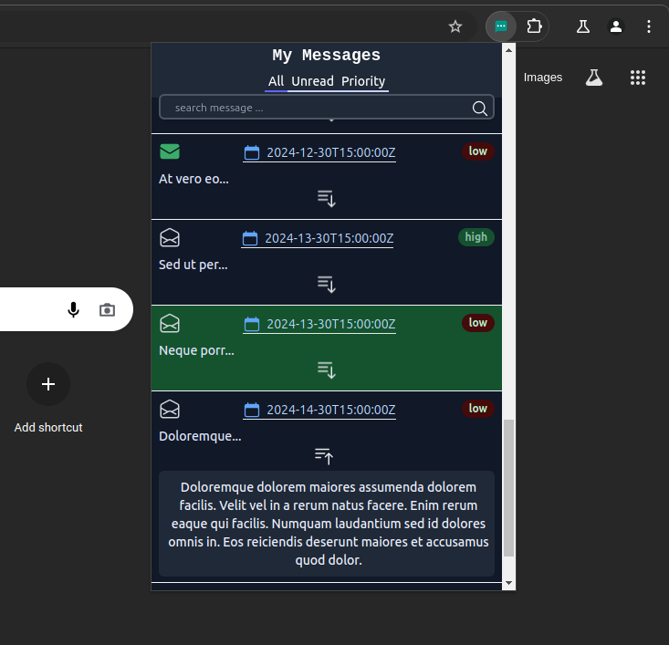
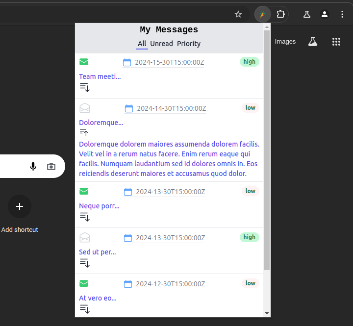
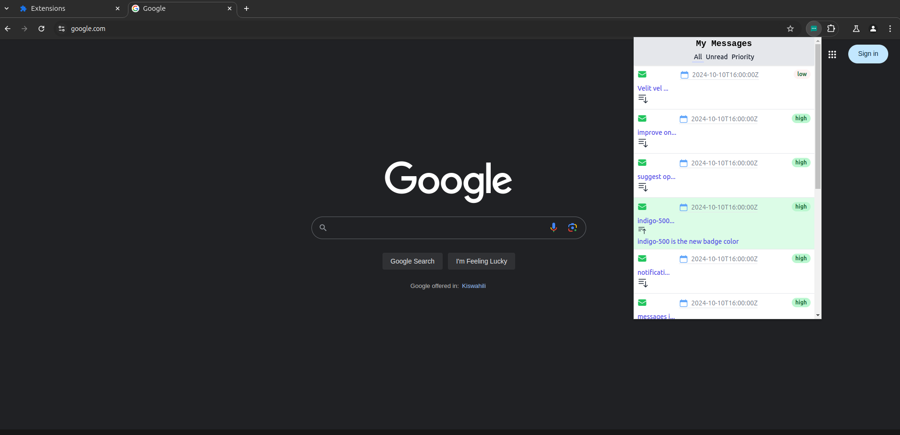
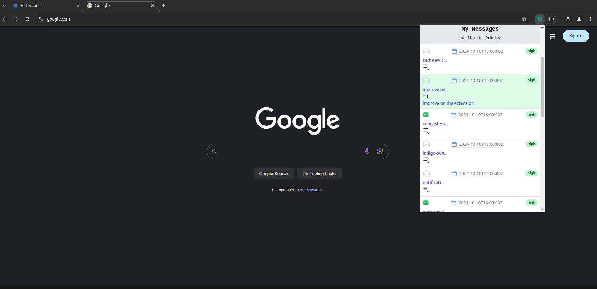
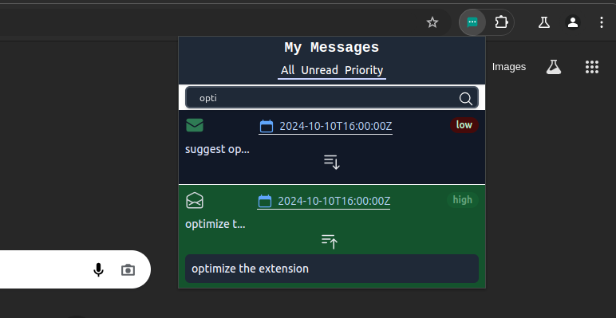
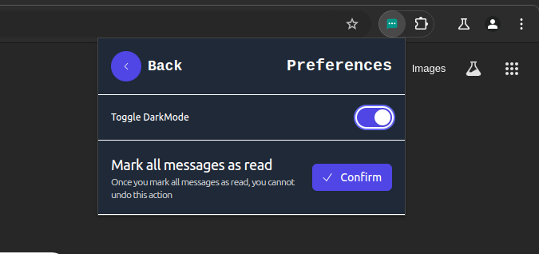

# React + Vite Chrome browser extension that displays organization-wide messages from an admin to users.

## Features
- Shows a badge icon when there are unread messages
- Displays messages in a popup when the extension icon is clicked
- Allows users to mark messages as read
- Stores message history locally
- Implements message categories or priority levels
- Adds notification sounds for high-priority messages

### quick overview
1. Backend Integration
- Run "json-server --watch db.json" To run mock an API endpoint that would provide messages in this format:
```json
    {
    "messages": [
    {
    "id": "msg123",
    "content": "Team meeting at 3 PM today 🙂",
    "priority": "high",
    "timestamp": "2024-09-30T15:00:00Z",
    "read": false
    }
    ]
    }
```
2. Frontend Implementation
- Uses React for the popup UI
- Implements and manages state using useState and useReducer hooks
- Styles the interface using CSS Tailwind

3. Extension Architecture
- Uses Chrome storage API to persist message state
- Implements a background script to check for new messages periodically
- Handles different states: loading, error, no messages, unread messages

4. It incorporates:
- Code organization and architecture
- State management and data flow
- Error handling and edge cases
- UI/UX considerations
- Performance optimization( useMemo, memo, lazy & suspense)
- Documentation and comments

## screenshots

#### DarkMode


#### All messages


#### Unread messages


#### High priority


#### Notifications badge


#### Search


#### User Preferences



#### npm test or yarn test
Runs the test watcher in an interactive mode.
By default, runs tests related to files changed since the last commit.

Read more about testing.

#### npm run build or yarn build
Builds the app for production to the build folder.
It correctly bundles React in production mode and optimizes the build for the best performance.

The build is minified and the filenames include the hashes.

Your app is ready to be deployed.

This template provides a minimal setup to get React working in Vite with HMR and some ESLint rules.

Currently, two official plugins are available:

- [@vitejs/plugin-react](https://github.com/vitejs/vite-plugin-react/blob/main/packages/plugin-react/README.md) uses [Babel](https://babeljs.io/) for Fast Refresh
- [@vitejs/plugin-react-swc](https://github.com/vitejs/vite-plugin-react-swc) uses [SWC](https://swc.rs/) for Fast Refresh
